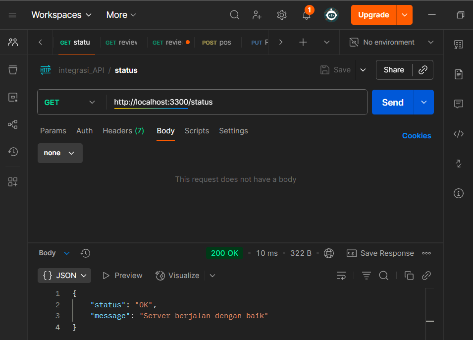
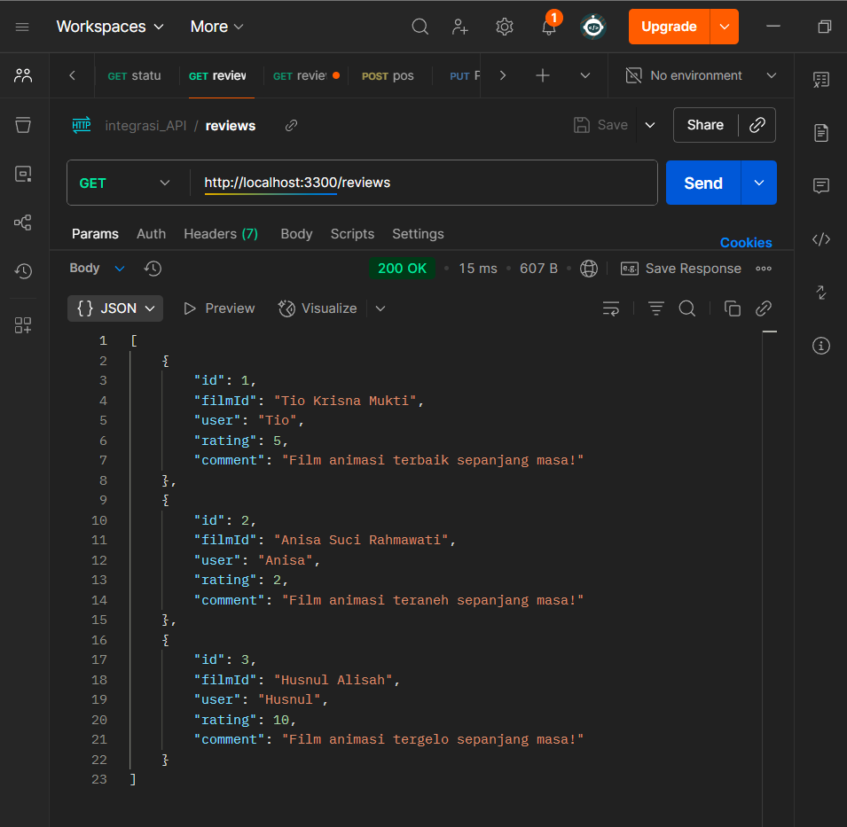
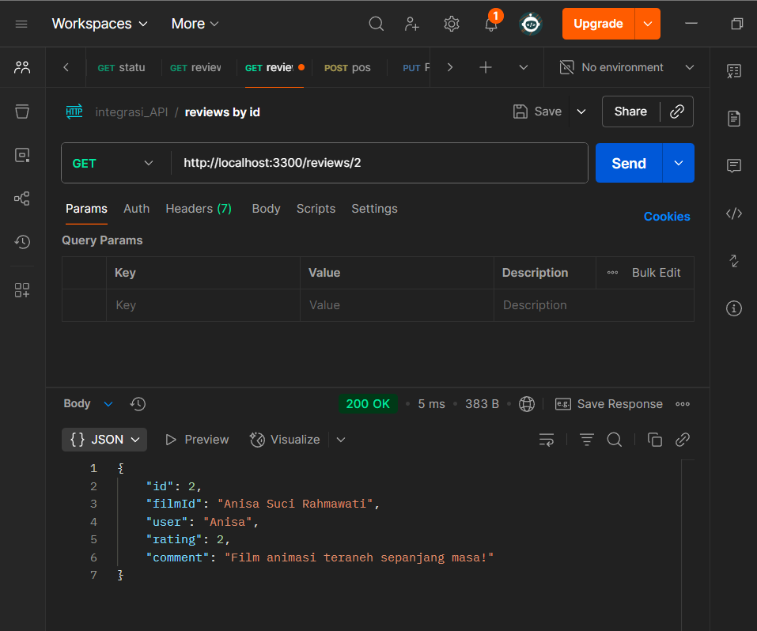
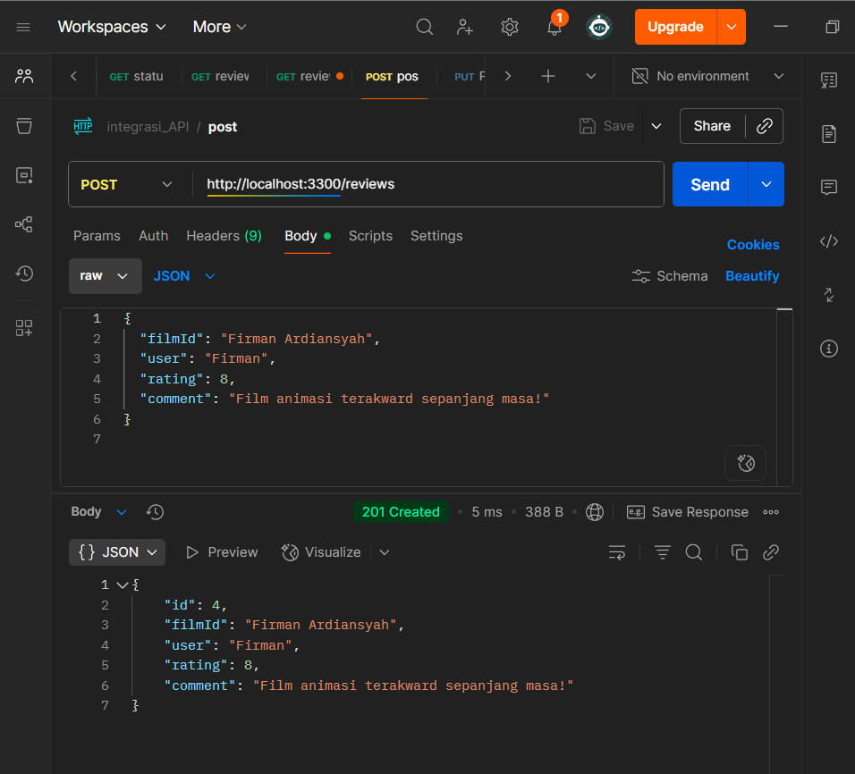
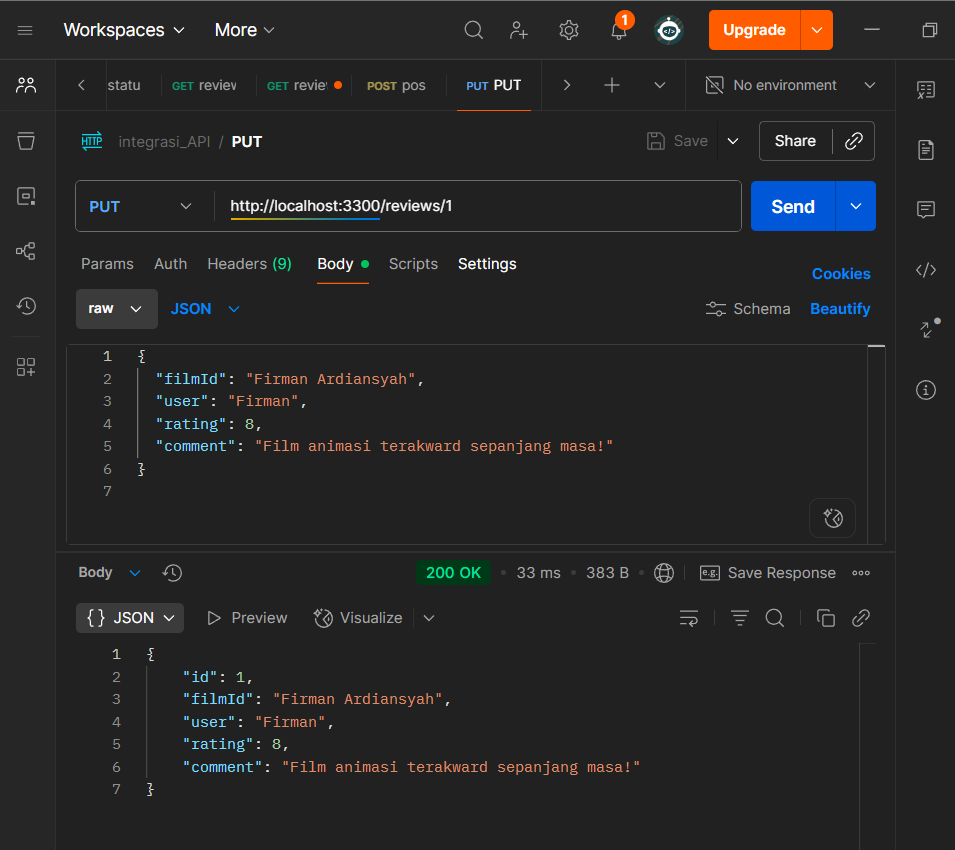
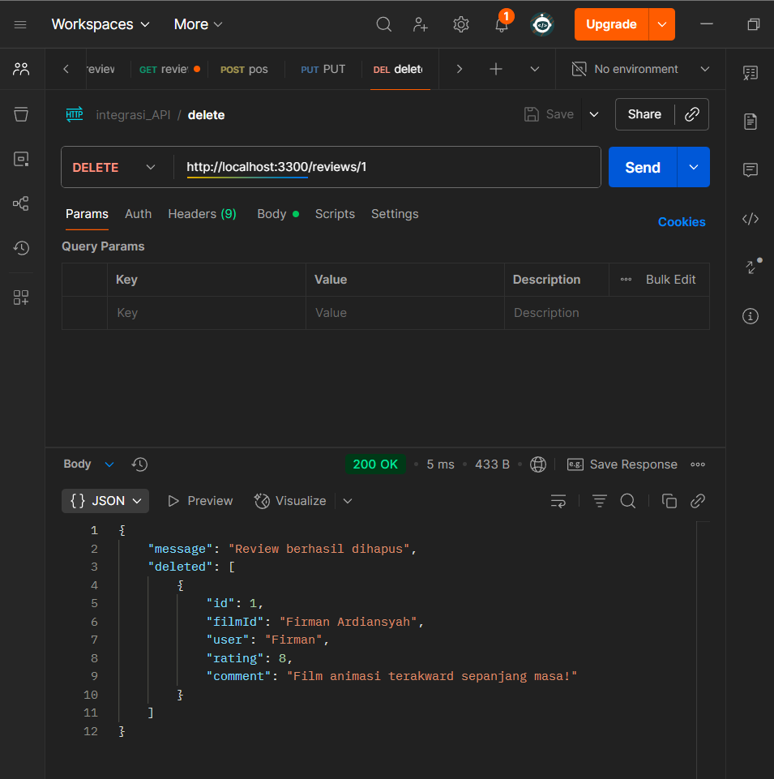

 # Proyek API Ulasan Film- Kelompok 8
 ## Anggota Kelompok- Nama Anggota 
 ### 1- TIO KRISNA MUKTI 362458302126
 ### 2- ANISA SUCI RAHMAWATI 362458302146
 ### 3- HUSNUL ALISAH 362458302099

 ## Deskripsi Proyek
 API ini adalah layanan internal untuk mengelola ulasan film
 dari Studio Ghibli,
 dengan data film yang direferensikan dari Ghibli API publik.

 ## Cara Menjalankan Proyek
 1. Clone repository ini: ‘git clone https://github.com/tiokrisna/integrasi-API.git‘
 2. Masuk ke direktori: ‘cd C:\Users\MyBook Hype AMD\Documents\INTEROPERABILITAS\integrasi-API‘
 3. Install dependensi: ‘npm install express cors‘
 4. Jalankan server: ‘nodemon server.js‘

 ## Daftar Endpoint
 Server akan berjalan di ‘http://localhost:3300‘.
 - ‘GET /status‘: Cek status API.

 - ‘GET /reviews‘: Mengambil semua ulasan.

 - ‘GET /reviews/:id‘: Mengambil ulasan spesifik.

 - ‘POST /reviews‘: Membuat ulasan baru.

 - ‘PUT /reviews/:id‘: Memperbarui ulasan.

 - ‘DELETE /reviews/:id‘: Menghapus ulasan
